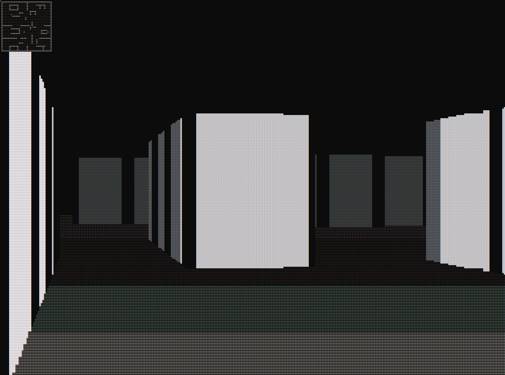
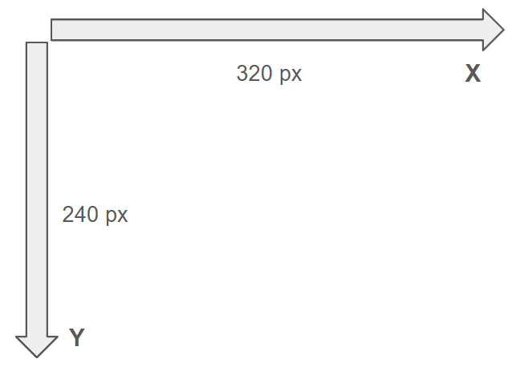
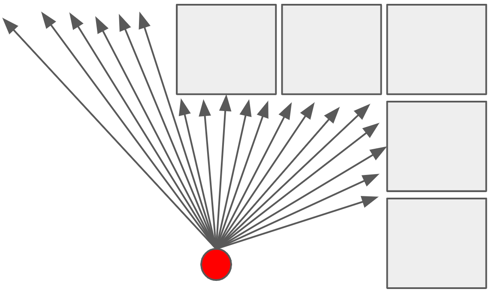

# Mazer
<p align="center">
  
</p>

## About Mazer
Mazer is a first-person maze exploration simulator, where the player navigates via keyboard
controls through a maze of their choice. The maze is generated in the console using ray casting.

The raycasting illusion involves a few steps:

* The user moves about in a 2D map of size 32x32, with the program tracking thier current position
and current viewing angle relitave to true north which is actually pointing in the -y direction, as
the coordinate system is defined as:
<p align="center">
  
</p>

* Every tick of the program, rays are cast across the user's FOV, from the very left to the very right
of the window. Each ray has its distance to a wall calculated using raymarching. This is done by 
calculating the unit vector of the current ray, and incrementing its distance until a collision occurs.

<p align="center">
  
</p>

* Subsequently, we can calculate the range of distances to walls across the user's FOV and display walls,
ceiling, and floor accordingly using ASCII characters. Close distance appears bright, with far distance dark.


### Built With
Mazer was built with:

* [![C++][cpp]][cpp-url]

This project was altered in V1.1 to interface with the olcGameEngine created by [OneLoneCoder](https://github.com/onelonecoder).


## Getting Started

### Prerequisites

* Visual Studio


### Installation


1. Clone the repo
   ```sh
   git clone https://github.com/santos-eng/Mazer.git
   ```
2. Alter the map if you would like to change your maze layout.
3. Build and run!

## Usage


* Use W and S to move forward and backward, respecitvely.
* A and D will rotate the user CCW and CW, repsectively.
* Q and E will allow strafing left and right, respectively.


[cpp]: https://img.shields.io/badge/C++-00599C?style=flat-square&logo=C%2B%2B&logoColor=white
[cpp-url]: https://cplusplus.com/
